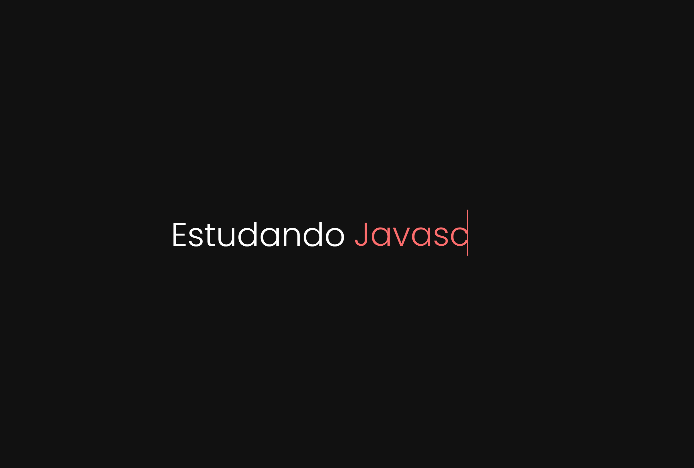

# Texto animado

Desenvolvido para aprendizado. Realizado efeito de texto animado. 11/10/22

[🔗 Clique aqui para acessar] (https://michel-maia.github.io/Texto-animado/)

## 💻 Tecnologias

- HTML
- CSS

## Referência

- [Youtube] https://www.youtube.com/c/FRONT123

- [mozilla] https://developer.mozilla.org/en-US/docs/Web/CSS/CSS_Animations/Using_CSS_animations

